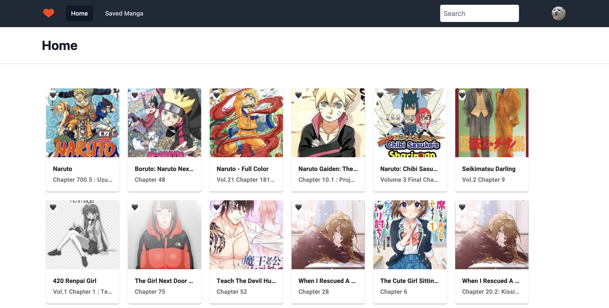
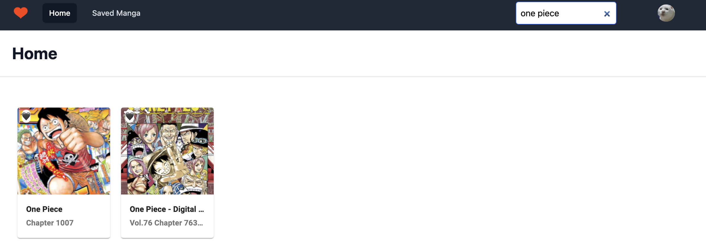
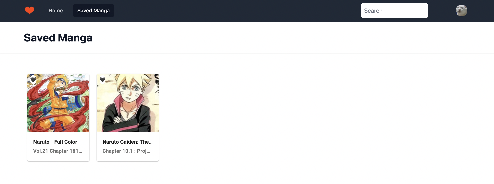
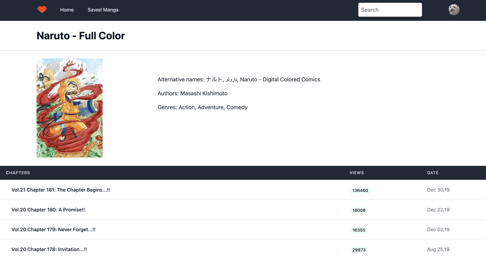

# Manga Reader

## User Story

```
As a Manga reader

I WANT an app that can let me read Mangas WITHOUT ADS
SO THAT I can view my Mangas freely

WHEN I click on a Home page
THEN I am presented with a list of Mangas to choose

WHEN I click on a heart button
THEN the manga will be added into the Saved page

WHEN I click on a Manga name
THEN I see the details of that specific Manga and it's chapters

WHEN I click on a Manga chapter
THEN I can read the manga without ADS
```

---

## Tables of content:

- [Description](#description)
- [Technologies](#technologies)
- [Usage](#usage)
- [Further Improvements](#improvements)
- [Questions](#questions)

---

## Description:

---

## Technologies:

- MERN STACK

  - Front End: React, Tailwind, JWT, JavaScript, GraphQL
  - Back End: Node, Express, MongoDB, Mongoose, GraphQL, APIs

---

## Usage:

- Create an account on the applications site, find mangas, add them to your favourite and read them!

Homepage of the app 

Returning a result from a search 

After clicking on a heart button, it will be saved to Saved Manga 

Clicking on to the Manga name, you will be directed into a details page 

---

## Improvements:

- A better favourite button UI
- Adding images to the page instead of redirecting to other webpage

---

## Questions:

For any further questions, contact the me at: tronglongphung@gmail.com

Github: [tronglongphung](https://github.com/tronglongphung)

[](https://opensource.org/licenses/MIT)
